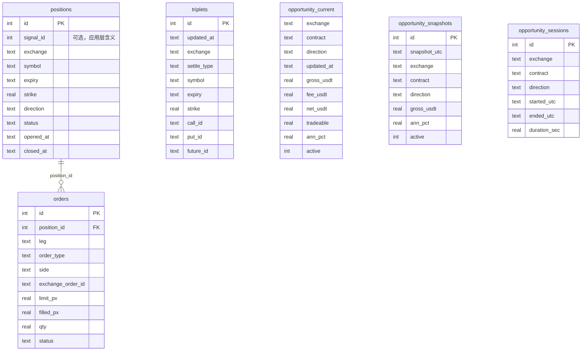

# PCP 套利系统：架构与业务流程

本文档描述当前代码库（`src/pcp_arbitrage`）的整体结构、运行时任务划分与端到端数据流，便于维护与扩展。细节公式与合约规则仍以 [PCP 套利设计说明](superpowers/specs/2026-04-04-pcp-arbitrage-design.md) 为准。

---

## 1. 目标与范围

- **业务目标**：基于 Put–Call Parity（PCP），在多家交易所上监控期权 + 对应交割/期货三腿组合的价差；计算毛利润、手续费、净利润与年化收益；可选地将结果输出到终端、全屏表格、Web 面板，并写入 SQLite / CSV。
- **自动交易（可选）**：达到更高年化阈值时，可走 **OKX** 三腿限价下单与平仓（见 `order_manager.py`）；其它交易所 Runner 主要负责行情与信号计算。
- **运行模型**：单进程 **asyncio** 多协程：各交易所独立 Runner + 若干后台循环（持久化、面板、余额轮询等）。

---

## 2. 模块与职责

| 模块 | 职责 |
|------|------|
| `main.py` | 加载配置、初始化信号输出、按配置启动各交易所 Runner 与后台任务 |
| `config.py` | 解析 `config.yaml` → `AppConfig` / `ExchangeConfig` |
| `exchanges/base.py` | `ExchangeRunner` 协议：`run()` 不返回 |
| `exchanges/okx.py` | OKX：REST 拉合约与费率、构建三元组、WebSocket 订书、驱动 PCP 评估 |
| `exchanges/binance.py` | Binance：同类流程（合约发现 + WS + 评估） |
| `exchanges/deribit.py` | Deribit 反向（币本位等）与线性 Runner 变体 |
| `okx_client.py` | OKX REST / WebSocket 客户端 |
| `instruments.py` | 从期权 + 期货列表构建 `(Call, Put, Future)` 三元组，ATM 范围与到期过滤 |
| `market_data.py` | 各所统一的内存订单簿视图 |
| `models.py` | `Triplet`、`BookSnapshot`、`FeeRates` 等 |
| `fee_fetcher.py` | 启动时拉取账户费率档位 |
| `pcp_calculator.py` | 正向/反向套利计算、`ArbitrageSignal`；币本位期货 USD 面值等 |
| `signal_output.py` | **中枢**：评估结果路由 → 仪表盘 / 经典打印 / DB / 通知 / 触发下单任务 |
| `signal_printer.py` | 经典模式多行控制台输出 |
| `opportunity_dashboard.py` | Rich 全屏表：当前机会行、会话、与 DB 同步逻辑 |
| `tracing.py` | 机会快照 CSV 缓冲与落盘 |
| `db.py` | SQLite：`triplets`、`opportunity_*`、`positions`/`orders` 等 |
| `order_manager.py` | OKX 三腿开仓 / 平仓、订单轮询与 DB 更新 |
| `notifier.py` | Telegram 等通知 |
| `web_dashboard.py` | aiohttp + Jinja2 + WebSocket：网页仪表盘与推送 |
| `position_tracker.py` | 轮询持仓与标记价格、PnL 告警、触发条件平仓 |
| `account_fetcher.py` | 各所账户余额（供 Web 展示） |
| `exchange_symbols.py` | 各所符号 / 行权价展示格式化 |

---

## 3. 运行时架构

### 3.1 进程与协程

```
┌─────────────────────────────────────────────────────────────────┐
│                        main._run()                               │
│  load_config → configure_signal_output → asyncio.gather(tasks)   │
└─────────────────────────────────────────────────────────────────┘
          │                    │                        │
          ▼                    ▼                        ▼
   ┌──────────────┐    ┌──────────────┐         ┌──────────────────┐
   │ OKXRunner    │    │ BinanceRunner│  ...    │ 后台循环（可选）  │
   │ .run()       │    │ .run()       │         │ CSV / SQLite /    │
   └──────────────┘    └──────────────┘         │ Rich / Web /      │
          │                    │               │ balance / tracker │
          └────────────────────┴───────────────┴──────────────────┘
                              │
                              ▼
                    signal_output.emit_*  ←  PCP 计算
```

- **交易所 Runner**：每个在 `config.yaml` 里 `enabled: true` 的交易所对应一个长期运行的 `asyncio` 任务。
- **监控就绪屏障**：启用仪表盘时，`configure_monitoring_barrier(N)` 与各 Runner 的 `notify_monitoring_ready()` 对齐，确保所有所完成 REST 初始化并开始 WS 后再启动 Rich 全屏表与启动扫市（`run_startup_revalidation_loop`）。

### 3.2 配置要点（`AppConfig`）

- **套利筛选**：`symbols`、`min_annualized_rate`、`atm_range`、`min_days_to_expiry`、`stale_threshold_ms`、`lot_size`。
- **下单阈值**：`order_min_annualized_rate`（高于「展示/记录」阈值时才视为触发自动下单与一次性通知）。
- **信号 UI**：`signal_ui` = `classic` | `dashboard`（全屏表需 TTY）。
- **追踪**：`opportunity_csv_*`、`pairing_log_dir`、`sqlite_path`。
- **Web**：`web_dashboard_*`。
- **风控与平仓**：`pnl_alert_threshold_pct`、`exit_days_before_expiry`、`exit_target_profit_pct`（持仓跟踪与平仓逻辑使用）。
- **交易所**：`ExchangeConfig` 含 `arbitrage_enabled`、API 凭证、`margin_type`（影响期货保证金标签：币本位 `USD` / U 本位 `USDT` / USDC 等）。

各字段来源见 `config.py` 与仓库中的 `config.yaml.example`（勿将真实密钥提交版本库）。

---

## 4. 核心业务数据流

### 4.1 启动阶段（每个交易所 Runner）

1. **REST**：拉期权列表、对应交割/期货列表、指数/现货价（用于 ATM 过滤）、账户费率（`FeeRates`）。
2. **三元组**：`instruments.build_triplets(...)` 生成 `(Call[K,T], Put[K,T], Future[T])`；无法匹配到同到期期货的到期日会被丢弃或记录（各所日志 / pairing 摘要）。
3. **注册元数据**：`register_dashboard_runner_meta` 把费率档位、三元组数量等写入仪表盘，并在配置 `sqlite_path` 时 `upsert_triplets`。
4. **WebSocket**：订阅订单簿（如 `books5` 或各所等价频道），更新内存 `BookSnapshot`。
5. **就绪**：`notify_monitoring_ready(exchange)`。

### 4.2 运行阶段（每次订单簿更新）

1. Runner 在相关合约有有效盘口时调用 `emit_triplet_if_books_ready(...)`。
2. `pcp_calculator` 对 **正向** 与 **反向** 各算一次 `ArbitrageSignal | None`（含新鲜度、手续费、年化）。
3. `emit_opportunity_evaluation`：
   - 写入 tracing（CSV 快照）；
   - 若年化 ≥ `min_annualized_rate`：更新 `OpportunityDashboard` 行；若仅 classic 模式则 `print_signal`；
   - 若年化 ≥ `order_min_annualized_rate` 且该 `(exchange, label, direction)` 尚未在本轮「激活」内通知过：Telegram、Web `push_notification`、并 `asyncio.create_task(order_manager.submit_entry(...))`（见下节说明）。

### 4.3 持久化与面板

| 循环 | 作用 |
|------|------|
| `run_opportunity_sqlite_loop` | 约每 10s 将当前机会行 `upsert` 到 `opportunity_current` |
| `run_triplet_db_refresh_loop` | 本地午夜重刷 `triplets` 表 |
| `run_opportunity_csv_loop` | 按间隔将机会快照刷到 CSV |
| `run_dashboard_loop` | Rich 全屏刷新（需 `signal_ui=dashboard`） |
| `run_web_dashboard_loop` | HTTP + WebSocket 推送 JSON 给浏览器 |
| `run_startup_revalidation_loop` | 屏障解除后执行各所 `startup_market_sweep`，校正从 DB 恢复的「伪活跃」行 |
| `run_position_tracker_loop` | 周期性检查持仓与盈亏，触发告警或 `submit_exit` |

---

## 5. 自动交易与风控（概要）

- **开仓**：`order_manager.submit_entry` 面向 **OKX** REST：三腿限价并行提交、轮询成交、SQLite 记录 `positions` / `orders`。重复同合约同方向未平仓头寸会跳过。
- **平仓**：`submit_exit` 读取开仓订单与当前盘口，下反向三腿；`position_tracker` 在浮盈或临近到期等条件下可调用。
- **`arbitrage_enabled`**：在 `ExchangeConfig` 与 Web 载荷中标识「是否允许自动套利」意图；**若需用该开关硬关下单，应在调用链上增加显式判断**（与仅监控场景区分）。

---

## 6. 数据库关系（SQLite）

Schema 由 `db.py` 的 `init_db()` 创建；除下列 **外键** 外，其余表之间在库内 **不设 FK**，通过 `(exchange, contract, direction)` 等字段在应用层关联。

### 6.1 ER 图



### 6.2 表分组与关联说明

| 分组 | 表 | 作用 |
|------|-----|------|
| 合约发现 | `triplets` | 按交易所覆盖写入当前扫描到的 `(call, put, future)` 三元组（`DELETE` 该所后批量 `INSERT`） |
| 机会监控 | `opportunity_current` | 主键 `(exchange, contract, direction)`，与内存仪表盘行同步，进程重启时可恢复 |
| 机会监控 | `opportunity_snapshots` | 追加型历史快照（如周期性落库），无唯一键约束 |
| 机会监控 | `opportunity_sessions` | 单次「机会从激活到结束」的区间与汇总指标；与 `opportunity_current` **逻辑上**对应同一 `(exchange, contract, direction)`，**非外键** |
| 自动交易 | `positions` | 一笔套利头寸（含 `status` 开/平等） |
| 自动交易 | `orders` | 三腿订单；`position_id` → `positions.id`（**唯一声明的 REFERENCES**） |

`positions.signal_id` 为可选整数，用于与评估侧 id 对齐，**当前库中无独立 `signals` 表**。

### 6.3 索引与其它

- `opportunity_sessions(ended_utc DESC)`：便于查最近结束会话。
- 启动时可能对 `opportunity_*` 等表做 `ALTER TABLE ADD COLUMN` 迁移（`_ensure_column`），与线上已有 DB 兼容。

完整列定义以 `src/pcp_arbitrage/db.py` 中 `init_db` 与后续 `_ensure_column` 为准。

---

## 7. 依赖与运维

- **包管理**：`pyproject.toml` + `uv.lock`。
- **进程管理**：可参考 `etc/supervisord.conf`、`Makefile`。
- **日志**：非 supervisor 环境下可写 `data/logs/pcp_arbitrage.log`；`dashboard_quiet_exchanges` 可降低交易所模块在仪表盘模式下的 INFO 噪声。

---

## 8. 相关文档

- [文档索引（上手路径）](README.md) — 主文档在 `docs/` 根下；`superpowers/` 内为可选历史规格，非必读。
- [PCP 套利监控系统设计（原版）](superpowers/specs/2026-04-04-pcp-arbitrage-design.md)
- [CCXT 适配设计（若涉及统一交易所抽象）](superpowers/specs/2026-04-04-ccxt-adapter-design.md)
- [各所保证金规则备忘](margin-rules-binance-okx-deribit.md)
